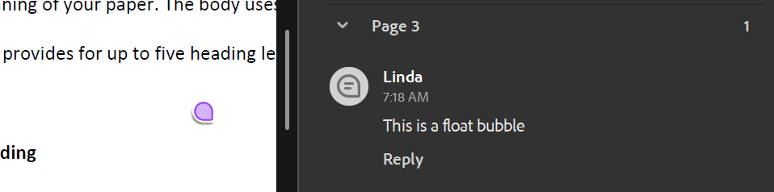
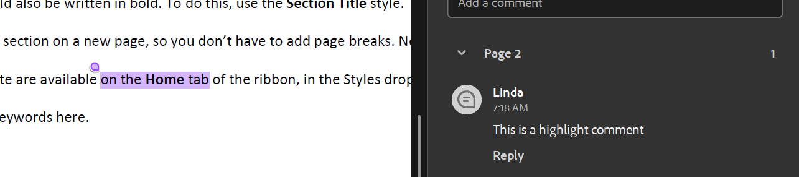
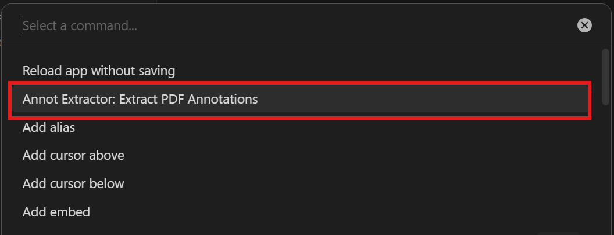
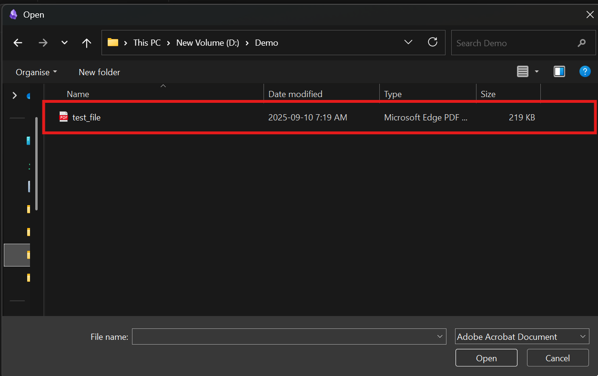
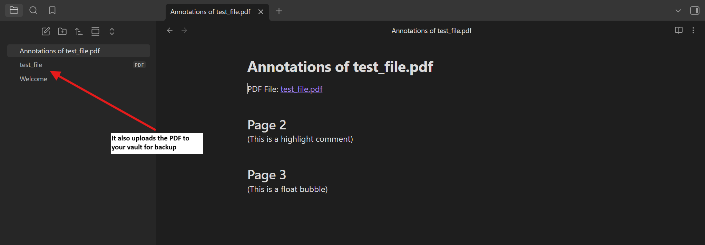

This [Obsidian](https://obsidian.md/) Plugin allows you to upload a PDF file to your Vault and extracts all the comments (currently included sticky notes and highlights) into a .md file.

The PDF can be annotated in with hightlight or sticky notes. Works best with comments done with Microsoft Edge and Adobe Acrobat.
 | 

# Demo

1. Trigger the extract command in Command Palette.

2. Select the PDF file.

3. The PDF is uploaded to your vault. And a .md file listing all comments is created.
